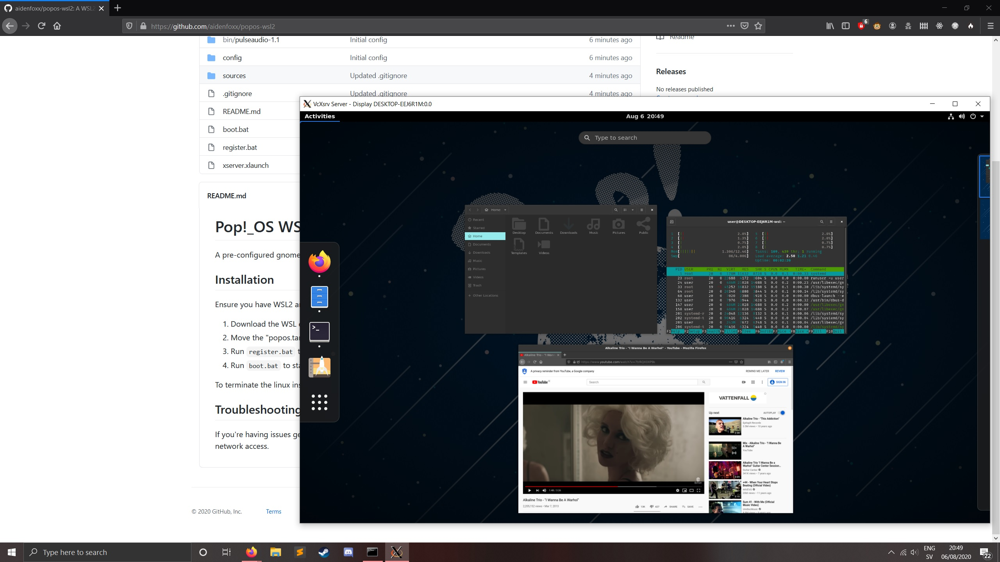

# PopOS WSL2 Instance

A pre-configured gnome desktop environment using xserver and pulseaudio passthrough.

## Installation

Ensure you have WSL2 and VcXsrv installed.

1. Download the WSL export (https://drive.google.com/file/d/1WlfEDtX0o6XGE6TtjILwI1iW7Se8rmZ5/view).
2. Move the `popos.tar.gz` file into the sources folder.
3. Run `register.bat` to register the distribution.
4. Run `boot.bat` to start the OS.

To terminate the linux instance simply log out.

## Notes

Default user details are: `user:popos` `root:popos`

## Troubleshooting

If you're having issues getting the distribution to display, ensure the all required services have Public and Private network access.
